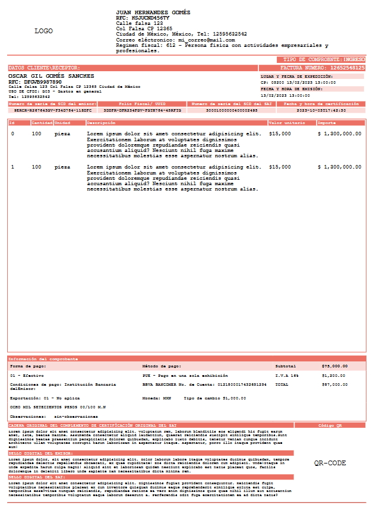
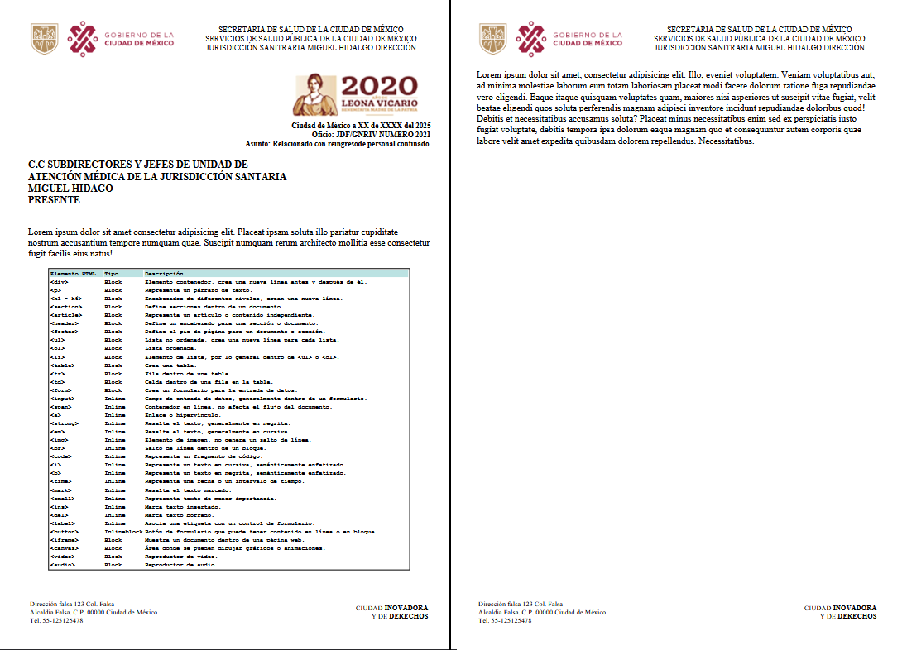
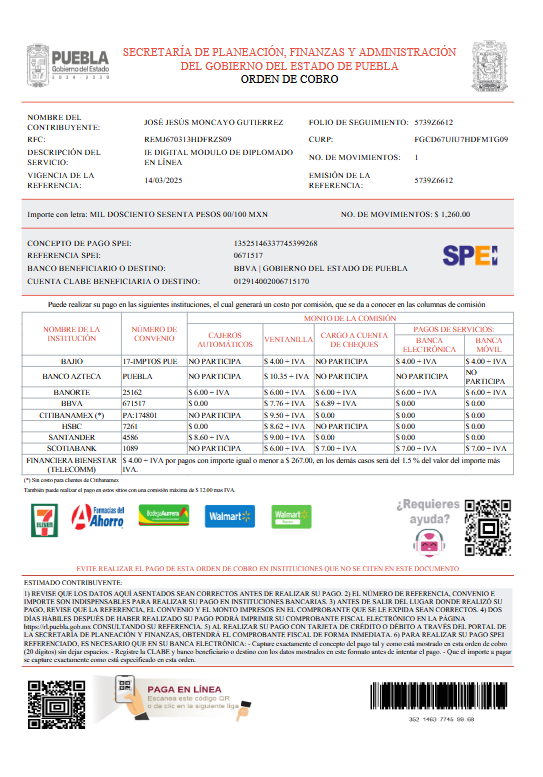
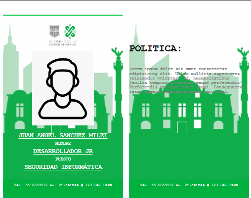

## Factura 

```php

use App\Http\Controllers\Dompdf\DompdfController;

Route::get('/dompdf-factura', [DompdfController::class, "factura"]);

view("DompdfViews.factura");

```


## Membretada 

```php

use App\Http\Controllers\Dompdf\DompdfController;

Route::get('/dompdf-membretada', [DompdfController::class, "membretada"]);

view("DompdfViews.membretada");

```


## Orden de pago 

```php

use App\Http\Controllers\Dompdf\DompdfController;

Route::get('/dompdf-ordenpago',  [DompdfController::class, "ordenpago"]);

view("DompdfViews.ordenpago");

```


## Credencial

```php

use App\Http\Controllers\Dompdf\DompdfController;

Route::get('/dompdf-credencial', [DompdfController::class, "credencial"]);

view("DompdfViews.credencial");

```
