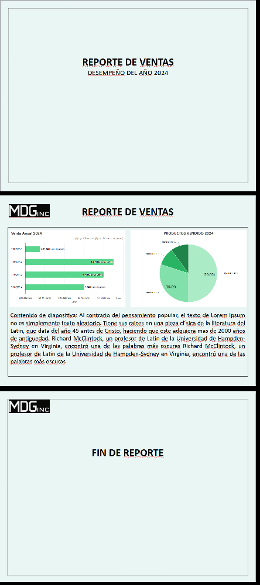
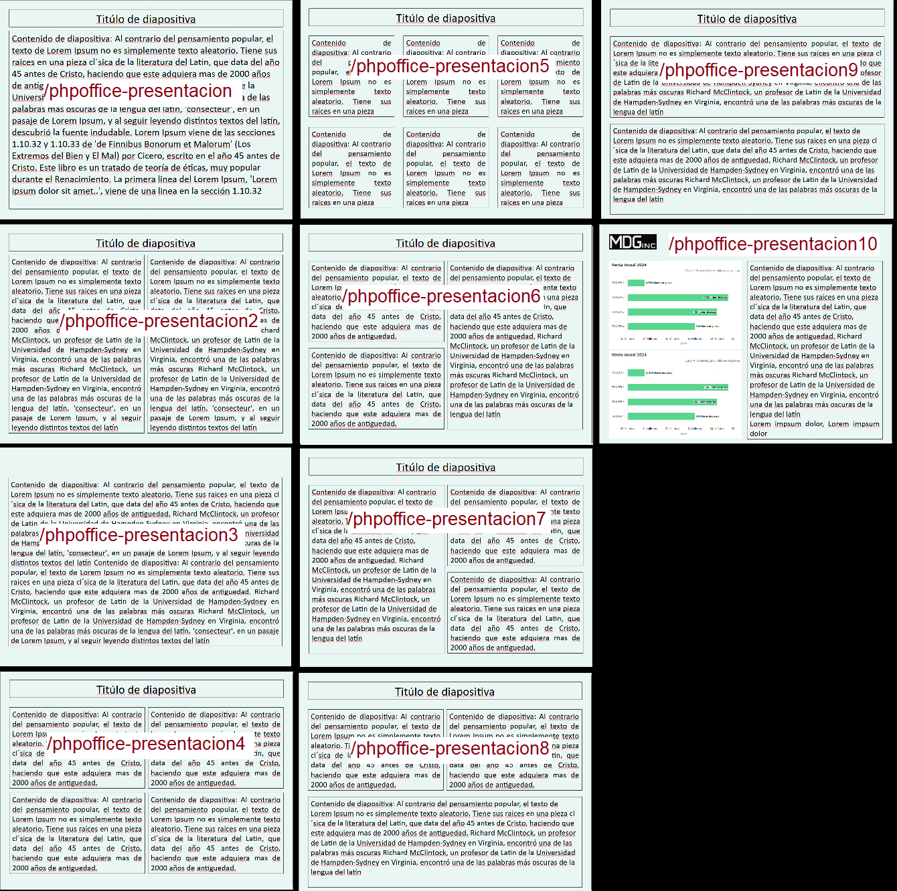

# PRESENTACIÓN


```php

use App\Http\Controllers\PPTController;    # Controller
use App\Clases\PphOffice\Presentaciondemo; # Clase

# Presentación 10
Route::get('/phpoffice-presentaciondemo', [ PPTController::class, 'presentaciondemo']);

```


# Templates de presentaciones PPT
#### Catalogo de template

```php

# Controller
use App\Http\Controllers\PPTController;

# Clases para cada template

use App\Clases\PphOffice\Presentacion;   # Presentación 1 
use App\Clases\PphOffice\Presentacion2;  # Presentación 2
use App\Clases\PphOffice\Presentacion3;  # Presentación 3 
use App\Clases\PphOffice\Presentacion4;  # Presentación 4
use App\Clases\PphOffice\Presentacion5;  # Presentación 5
use App\Clases\PphOffice\Presentacion6;  # Presentación 6
use App\Clases\PphOffice\Presentacion7;  # Presentación 7
use App\Clases\PphOffice\Presentacion8;  # Presentación 8
use App\Clases\PphOffice\Presentacion9;  # Presentación 9
use App\Clases\PphOffice\Presentacion10; # Presentación 10

// Templates phpoffice/phppresentation

    Route::get('/phpoffice-presentacion',     [ PPTController::class, 'presentacion'    ]);
    Route::get('/phpoffice-presentacion2',    [ PPTController::class, 'presentacion2'   ]);
    Route::get('/phpoffice-presentacion3',    [ PPTController::class, 'presentacion3'   ]);
    Route::get('/phpoffice-presentacion4',    [ PPTController::class, 'presentacion4'   ]);
    Route::get('/phpoffice-presentacion5',    [ PPTController::class, 'presentacion5'   ]);
    Route::get('/phpoffice-presentacion6',    [ PPTController::class, 'presentacion6'   ]);
    Route::get('/phpoffice-presentacion7',    [ PPTController::class, 'presentacion7'   ]);
    Route::get('/phpoffice-presentacion8',    [ PPTController::class, 'presentacion8'   ]);
    Route::get('/phpoffice-presentacion9',    [ PPTController::class, 'presentacion9'   ]);
    Route::get('/phpoffice-presentacion10',   [ PPTController::class, 'presentacion10'  ]);
```



Para crear un .pptx el servidor tiene que tener habilitado el zip

Documentation: https://phppowerpoint.readthedocs.io/en/latest/intro.html

# para habilitar ZipArchive

## En linux
```bash
sudo apt-get update
sudo apt-get install php-zip
```

Despues se debe de reiniciar el servidor 

```bash
sudo service apache2 restart
# o si usas php-fpm:
sudo service php8.1-fpm restart
```

## En Windows (XAMPP/WAMP)

Abriri php.ini y descomentar la linea ;extension=zip

```bash
extension=zip
```

## Verificar si está habilitado

```bash
php -m | grep zip
```