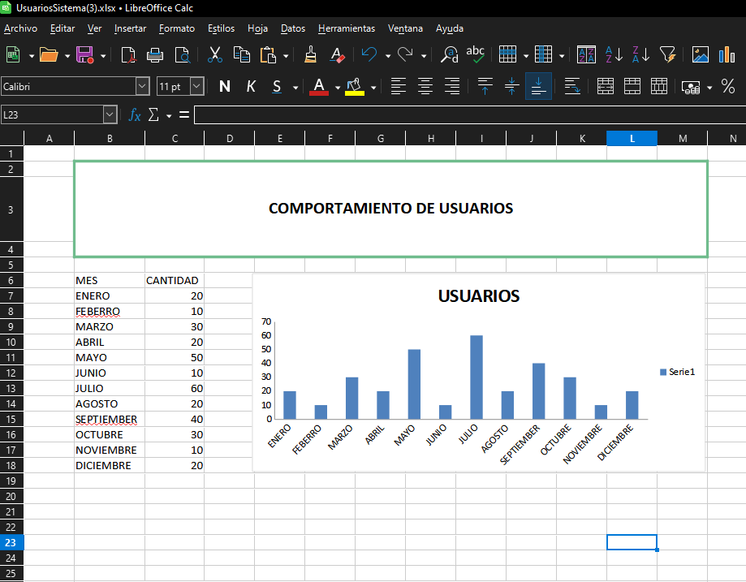
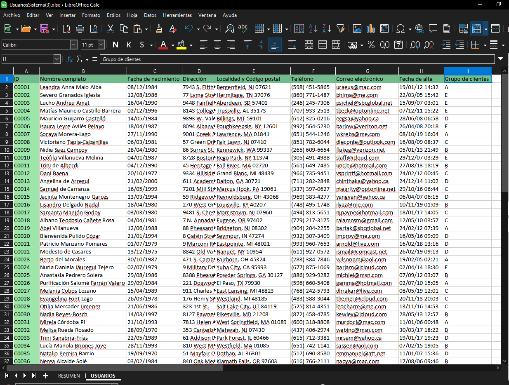

# PHPOFFICE / SPREADSHEET

Librería que permite generar en docuemntos ademas:
    .- Incluir vairias hojas en docuemnto
    .- Incluir Style en hojas
    .- Incluir Grafícos 


## Ejemplo reporte generico

```php
# Controlador para docuemntos excel
use App\Http\Controllers\SpreadSheetController;

# Clase 
use App/Clases/PphOffice/phpSpreadsheet/HojaExcel.php

// Router
    Route::get('/phpoffice-spreadsheet', [SpreadSheetController::class, 'excel']);
```




