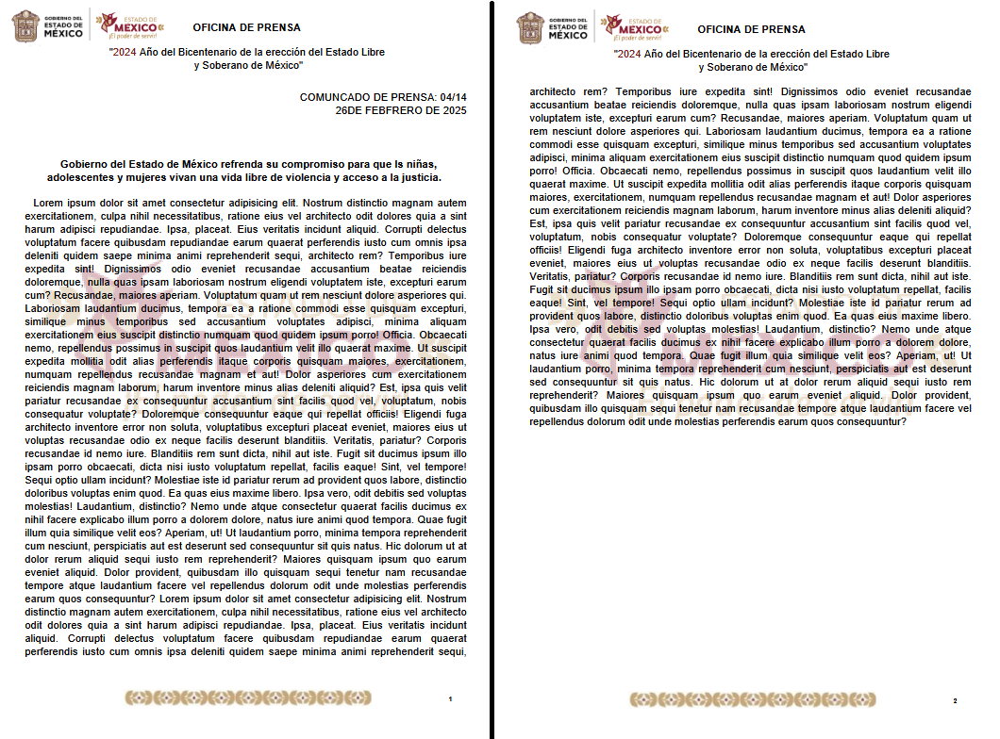
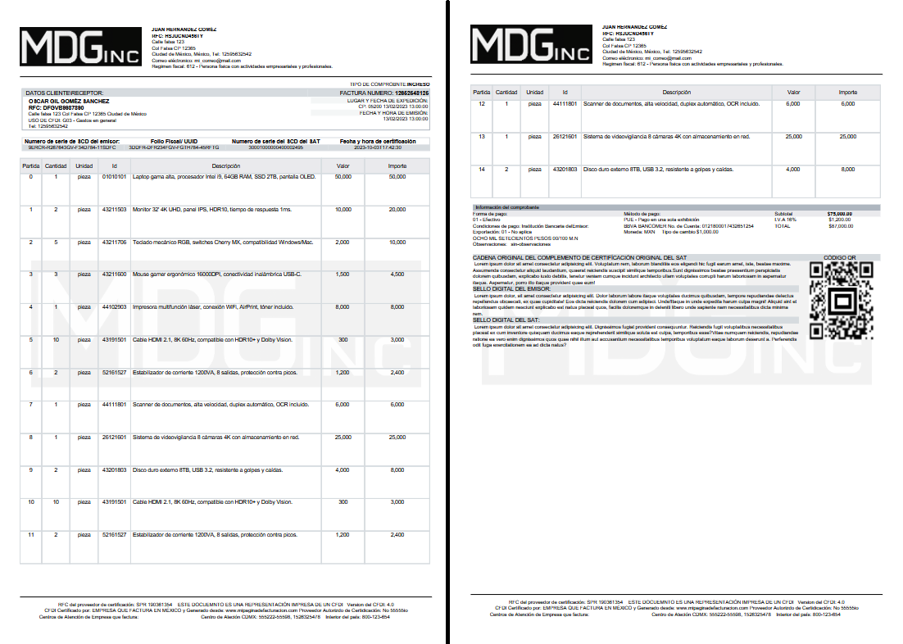

### documento genérico

```php

use App\Clases\TcpdfClases\TCPDFDocumento; // clase del documento

Route::get('/tcpdf-documento', [TcpdfController::class, "documento"]);

views("TcpdfViews.documento");  // vista del documento

```



### factura

```php

use App\Clases\TcpdfClases\TCPDFDocumento; // clase del documento

Route::get('/tcpdf-factura', [TcpdfController::class, "factura"]);

// carpeta con las vistas
// TcpdfViews/ 
// body, cliente, comprobante, footer, header, scd, sellos
// views("TcpdfViews. ...  ")->rendr(); 

```
