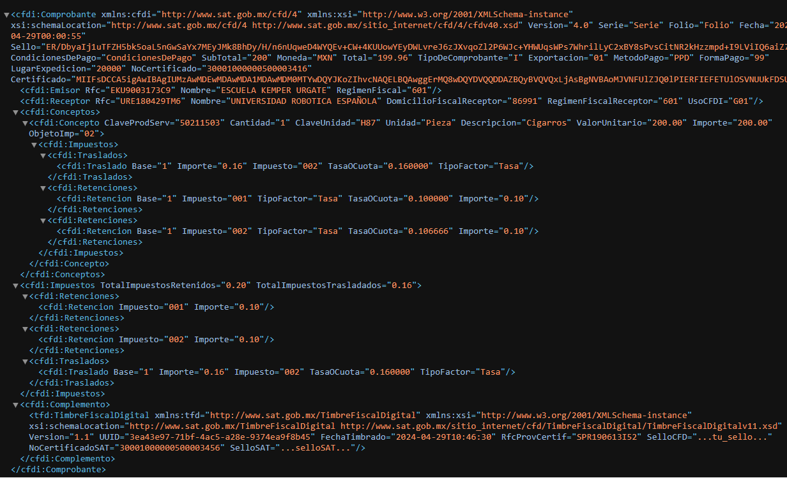

# Generador de archvio XML

```php

// CONTROLLER
    # Controlador para datos xml
    use App\Http\Controllers\XMLController;

        use App\Clases\xml\GenerateXML;     // en controller
        use Illuminate\Http\Request;     // en controller
        use Illuminate\Support\Str;     // en controller
        use Illuminate\Http\Response;     // en controller
        use Symfony\Component\HttpFoundation\HeaderUtils;     // en controller
        use Illuminate\Support\Facades\Storage;     // en controller

// ROUTER
// XML
    # Genera documento en xml a partir de una array y lo muestra o descarga
    # name: nombre del docuemnto con extencio .xml
    # manageout: attachment, inline = attachment: descargar docuemnto, inline: mostrar en el navegador
    # savecopy: gurada un copia en ele servidor en este path Storage/app/xmlout = 'yes' para que se guarde
    Route::get('/arr2xml/{name}/{manageout}/{savecopi?}', [XMLController::class, 'array2xml']);


// Clase que genera array a xml
use Spatie\ArrayToXml\ArrayToXml;    // <- clase que hace el parseo de array a xml

class GenerateXML
{
    public function xmlfromarray($array, $root, $d, $codificacion){
        $xmlout = new ArrayToXml($array, $root, $d, $codificacion);
        $xml = $xmlout->toxml();
        return $xml;
    }
}

```



